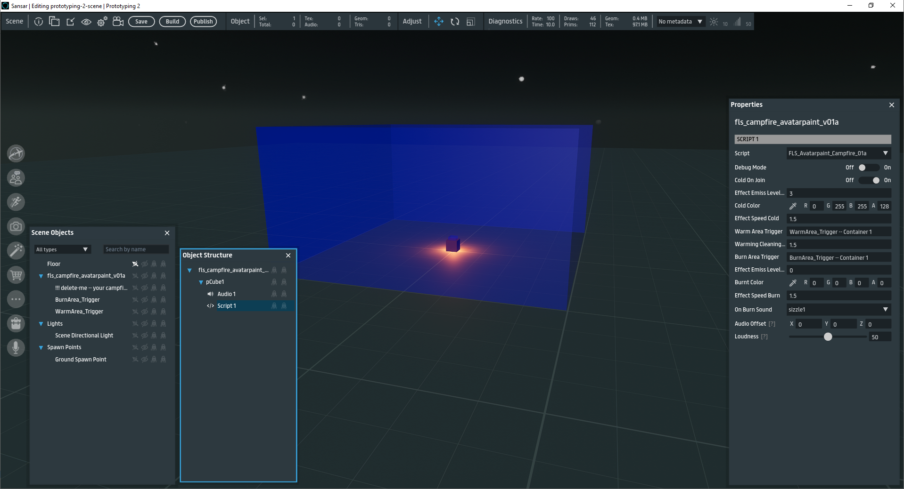
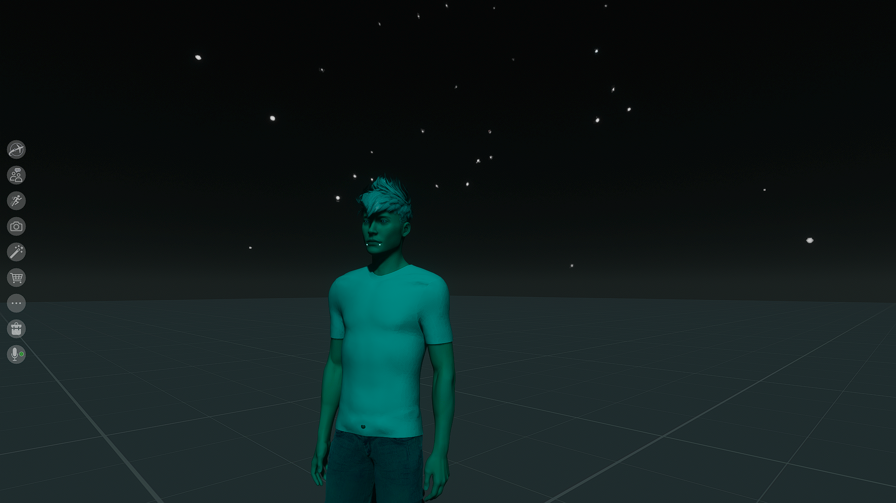
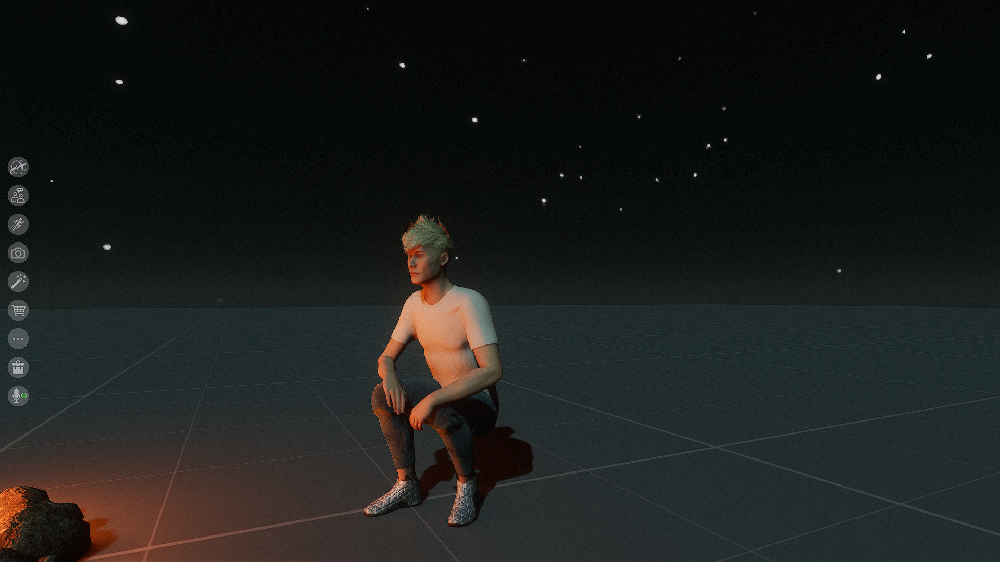

# AvatarPaint Campfire - Sansar Script

**Author:** Freelight  
**Date:** November 1, 2024

The **AvatarPaint Campfire** is a demo script that shows how to enhance avatar interactivity around a virtual campfire in Sansar, by tinting them warm/cold/burnt by using two TriggerVolumes on the CampFire area itself. It changes the avatar's appearance based on their proximity to the campfire's triggers, simulating "cold," "warm," and "burnt" effects.

## Description

The **AvatarPaint Campfire** script uses two overlapping triggers around a campfire to modify avatars' material properties, creating visual cues for warmth and burning -- both triggers must be slotted into script in editor

**WarmAreaTrigger**: When avatars are inside this area, they appear "warm" (returning to each's normal colors).
**ColdColor**: Avatars outside the campfire area take on a "cold" tint, like cyan or blue.
**BurnAreaTrigger**: A small trigger within the center of the campfire, which makes avatars look burnt (dark tint) and plays a "sizzle" sound.
**Triggers Overlap**: The **WarmAreaTrigger** and **BurnAreaTrigger** can overlap without issues.

## Setup and Usage

### Instructions
1. **Add the Script**: Attach the `FLS_Avatarpaint_Campfire_01a` script to an object in the scene.
2. **Configure Triggers**:
   - **WarmAreaTrigger**: Set up an area around the campfire to represent warmth.
   - **BurnAreaTrigger**: Create a small trigger directly in the center of the campfire to simulate burning.
3. **Customize Properties** (optional):
   - Adjust colors, speeds, and intensities for the "cold," "warm," and "burnt" states via the script’s public fields in the inspector -- but the default values work quite good, unexpected results and overlapping material interpolations can occur when effect speed values are set too high/too long in duration
   - Toggle **ColdOnJoin** to determine if avatars appear "cold" when they join the scene by default, otherwise they would have to enter the WarmAreaTrigger, and leave it before turning 'Cold' tinted.
   - Assign the desired **sizzle** sound file for the burning effect.

### Public Properties

| Property               | Description                                                                                       |
|------------------------|---------------------------------------------------------------------------------------------------|
| `DebugMode`            | Enable to log debugging information.                                                              |
| `ColdOnJoin`           | If true, avatars will take on a cold color upon joining the scene.                                |
| `EffectEmissLevelCold` | Emissive intensity for the "cold" effect.                                                         |
| `ColdColor`            | Color applied to avatars when they are in the "cold" state.                                       |
| `EffectSpeedCold`      | Speed of the transition when avatars enter/leave the cold effect.                                 |
| `WarmAreaTrigger`      | The trigger area representing warmth around the campfire.                                         |
| `WarmingCleaningSpeed` | Speed of transition back to the normal (warm) appearance.                                         |
| `BurnAreaTrigger`      | Small trigger area in the campfire center that applies the "burnt" effect and sound.              |
| `EffectEmissLevelBurnt`| Emissive intensity for the "burnt" effect.                                                        |
| `BurntColor`           | Color applied when the avatar enters the burn area.                                               |
| `EffectSpeedBurn`      | Speed of transition to the burnt appearance.                                                      |
| `OnBurnSound`          | Audio resource to play when avatars enter the **BurnAreaTrigger**.                                |

## Implementation Details

The script saves the avatar's initial material properties upon joining the scene. When an avatar:
- **Enters the WarmAreaTrigger**: The avatar reverts to its original "warm" material properties.
- **Exits the WarmAreaTrigger**: If configured, the avatar appears "cold."
- **Enters the BurnAreaTrigger**: The avatar’s materials take on a burnt appearance and play a "sizzle" sound.

